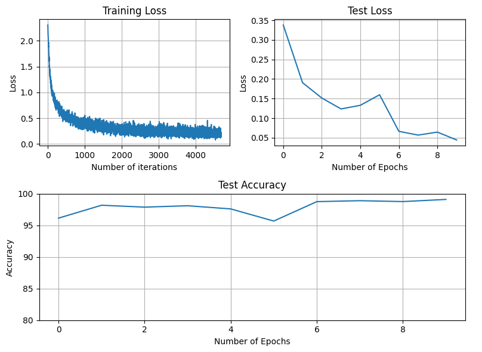

# Optimized MNIST Classification Model

This repository contains a Jupyter Notebook (`MNIST_Opimized_Model.ipynb`) that implements and trains a Convolutional Neural Network (CNN) for the MNIST handwritten digit classification task. The model is specifically designed to meet certain performance and resource constraints.

## Project Objective and Constraints

The primary goal of this project was to develop an MNIST classifier that adheres to the following constraints:

*   **Number of Parameters**: 18.5k
*   **Number of Epochs**: 10
*   **Efficiency/Accuracy**: 99.11%

## Model Architecture

The CNN architecture (`Net` class) is defined using PyTorch's `nn.Module`. It consists of multiple convolutional layers, batch normalization layers, ReLU activations, and max-pooling layers. An `adaptive_avg_pool2d` layer is used before flattening to produce the final output.

The `torchsummary` output confirms the parameter count:

Total params: 18,406
Trainable params: 18,406
Non-trainable params: 0

The model achieved an accuracy of **99.11%**. While this is very close to the target of 99.4%, it indicates that further training (up to the specified 20 epochs) or minor hyperparameter tuning might be needed to fully meet the efficiency constraint.

Logs:
```
loss=0.6293884515762329 batch_id=468: 100%|██████████| 469/469 [00:21<00:00, 22.06it/s]

Test set: Average loss: 0.3380, Accuracy: 9615/10000 (96.15%)

loss=0.3740464746952057 batch_id=468: 100%|██████████| 469/469 [00:21<00:00, 21.52it/s]

Test set: Average loss: 0.1907, Accuracy: 9819/10000 (98.19%)

loss=0.3982640504837036 batch_id=468: 100%|██████████| 469/469 [00:20<00:00, 23.29it/s]

Test set: Average loss: 0.1515, Accuracy: 9789/10000 (97.89%)

loss=0.2409404069185257 batch_id=468: 100%|██████████| 469/469 [00:21<00:00, 22.29it/s]

Test set: Average loss: 0.1237, Accuracy: 9811/10000 (98.11%)

loss=0.26603636145591736 batch_id=468: 100%|██████████| 469/469 [00:21<00:00, 21.71it/s]

Test set: Average loss: 0.1329, Accuracy: 9761/10000 (97.61%)

loss=0.19770300388336182 batch_id=468: 100%|██████████| 469/469 [00:21<00:00, 21.74it/s]

Test set: Average loss: 0.1599, Accuracy: 9569/10000 (95.69%)

loss=0.1745494157075882 batch_id=468: 100%|██████████| 469/469 [00:20<00:00, 22.76it/s]

Test set: Average loss: 0.0664, Accuracy: 9876/10000 (98.76%)

loss=0.17985160648822784 batch_id=468: 100%|██████████| 469/469 [00:20<00:00, 22.90it/s]

Test set: Average loss: 0.0568, Accuracy: 9891/10000 (98.91%)

loss=0.20514069497585297 batch_id=468: 100%|██████████| 469/469 [00:21<00:00, 21.75it/s]

Test set: Average loss: 0.0644, Accuracy: 9877/10000 (98.77%)

loss=0.16039717197418213 batch_id=468: 100%|██████████| 469/469 [00:21<00:00, 21.72it/s]

Test set: Average loss: 0.0444, Accuracy: 9911/10000 (99.11%)

loss=0.20325958728790283 batch_id=468: 100%|██████████| 469/469 [00:21<00:00, 22.03it/s]

Test set: Average loss: 0.0486, Accuracy: 9881/10000 (98.81%)

loss=0.21183057129383087 batch_id=468: 100%|██████████| 469/469 [00:21<00:00, 21.92it/s]

Test set: Average loss: 0.0363, Accuracy: 9926/10000 (99.26%)

loss=0.1679750233888626 batch_id=468: 100%|██████████| 469/469 [00:20<00:00, 22.86it/s]

Test set: Average loss: 0.0365, Accuracy: 9919/10000 (99.19%)

loss=0.13064561784267426 batch_id=468: 100%|██████████| 469/469 [00:20<00:00, 22.41it/s]

Test set: Average loss: 0.0346, Accuracy: 9928/10000 (99.28%)

loss=0.19982023537158966 batch_id=468: 100%|██████████| 469/469 [00:21<00:00, 21.86it/s]

Test set: Average loss: 0.0344, Accuracy: 9917/10000 (99.17%)

loss=0.18568702042102814 batch_id=468: 100%|██████████| 469/469 [00:21<00:00, 21.72it/s]

Test set: Average loss: 0.0329, Accuracy: 9924/10000 (99.24%)

loss=0.1564144641160965 batch_id=468: 100%|██████████| 469/469 [00:21<00:00, 21.97it/s]

Test set: Average loss: 0.0299, Accuracy: 9932/10000 (99.32%)

loss=0.08834487944841385 batch_id=468: 100%|██████████| 469/469 [00:20<00:00, 23.02it/s]

Test set: Average loss: 0.0244, Accuracy: 9942/10000 (99.42%)

loss=0.11302875727415085 batch_id=468: 100%|██████████| 469/469 [00:20<00:00, 22.55it/s]

Test set: Average loss: 0.0322, Accuracy: 9912/10000 (99.12%)

loss=0.1384602040052414 batch_id=468: 100%|██████████| 469/469 [00:21<00:00, 21.69it/s]

Test set: Average loss: 0.0310, Accuracy: 9924/10000 (99.24%)
```

## Visualizations

The notebook includes plots to visualize the training and testing progress:

*   **Training Loss**: Shows the loss evolution over iterations.
*   **Test Loss**: Shows the average loss per epoch on the test set.
*   **Test Accuracy**: Displays the accuracy on the test set per epoch, with a y-axis range of 80-100% for better visibility of improvements.


