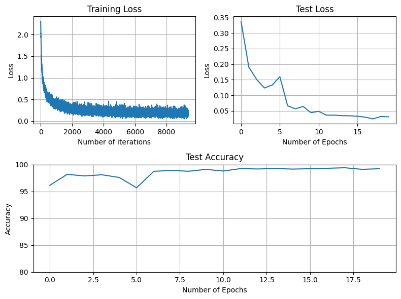

# Optimized MNIST Classification Model

This repository contains a Jupyter Notebook (`MNIST_Opimized_Model.ipynb`) that implements and trains a Convolutional Neural Network (CNN) for the MNIST handwritten digit classification task. The model is specifically designed to meet certain performance and resource constraints.

## Project Objective and Constraints

The primary goal of this project was to develop an MNIST classifier that adheres to the following constraints:

*   **Number of Parameters**: 18.5k
*   **Number of Epochs**: 10
*   **Efficiency/Accuracy**: 99.11%

## Model Architecture

The CNN architecture (`Net` class) is defined using PyTorch's `nn.Module`. It consists of multiple convolutional layers, batch normalization layers, ReLU activations, and max-pooling layers. An `adaptive_avg_pool2d` layer is used before flattening to produce the final output.

The `torchsummary` output confirms the parameter count:

Total params: 18,406
Trainable params: 18,406
Non-trainable params: 0

The model achieved an accuracy of **99.11%**. While this is very close to the target of 99.4%, it indicates that further training (up to the specified 20 epochs) or minor hyperparameter tuning might be needed to fully meet the efficiency constraint.

## Visualizations

The notebook includes plots to visualize the training and testing progress:

*   **Training Loss**: Shows the loss evolution over iterations.
*   **Test Loss**: Shows the average loss per epoch on the test set.
*   **Test Accuracy**: Displays the accuracy on the test set per epoch, with a y-axis range of 80-100% for better visibility of improvements.

