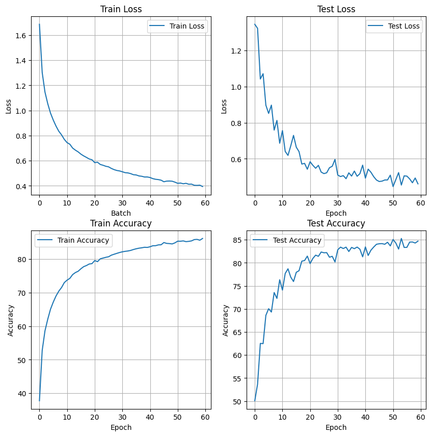

# CIFAR-10 Image Classification with PyTorch

This repository contains code for training Convolutional Neural Networks (CNNs) on the CIFAR-10 dataset using PyTorch. It explores different model architectures, including a standard CNN and one utilizing Depthwise Separable Convolutions for improved efficiency.

## Table of Contents

- [Project Overview](#project-overview)
- [Features](#features)
- [Model Architectures](#model-architectures)
- [Dataset](#dataset)
- [Dependencies](#dependencies)
- [Usage](#usage)
- [Results](#results)
- [Files](#files)

## Project Overview

This project aims to classify images from the CIFAR-10 dataset. The CIFAR-10 dataset consists of 60,000 32x32 colour images in 10 classes, with 6,000 images per class. There are 50,000 training images and 10,000 test images.

## Features

- **Data Loading and Preprocessing**: Utilizes `torchvision` and `albumentations` for efficient data loading, augmentation, and normalization.
- **Custom CNN Models**: Implementation of a basic CNN (`model_v0.py`) and an optimized CNN using Depthwise Separable Convolutions (`model_v1.py`).
- **Training and Evaluation Loop**: Standard PyTorch training and testing functions with progress bars (`tqdm`) and loss/accuracy tracking.
- **Learning Rate Scheduling**: Employs `ReduceLROnPlateau` to adjust the learning rate dynamically.
- **Model Checkpointing**: Saves the best performing model based on test loss.
- **Visualization**: Includes code for visualizing dataset samples and training/testing metrics.

## Model Architectures

### `model_v0.py` - Standard CNN

This model implements a traditional CNN architecture with multiple convolutional layers, batch normalization, ReLU activations, and max-pooling layers. It uses a series of `Conv2d` layers followed by `BatchNorm2d` and `ReLU` for feature extraction, culminating in an adaptive average pooling layer and a final linear layer for classification.

### `model_v1.py` - Depthwise Separable Convolution CNN

This version introduces `DepthwiseSeparableConv` blocks to the CNN architecture. Depthwise Separable Convolutions are designed to reduce the number of parameters and computational cost while maintaining competitive accuracy. This model uses these specialized convolutions in its second and third blocks, aiming for a more efficient network.

## Dataset

The project uses the CIFAR-10 dataset. The dataset is automatically downloaded if not already present.
- **Mean**: `(0.49139968, 0.48215827, 0.44653124)`
- **Standard Deviation**: `(0.24703233, 0.24348505, 0.26158768)`

**Data Augmentations (Training)**:
- `Resize` (32x32)
- `HorizontalFlip`
- `ShiftScaleRotate`
- `CoarseDropout`
- `Normalize`
- `ToTensorV2`

**Data Augmentations (Testing)**:
- `Resize` (32x32)
- `Normalize`
- `ToTensorV2`

## Dependencies

The following Python libraries are required:
- `torch`
- `torchvision`
- `numpy`
- `matplotlib`
- `opencv-python` (`cv2`)
- `albumentations`
- `torchsummary`
- `tqdm`

You can install these dependencies using pip:
```bash
pip install torch torchvision numpy matplotlib opencv-python albumentations torchsummary tqdm
```
If running in Google Colab, `torchsummary` and `albumentationsx` might need to be installed separately as shown in the notebook.

## Results

The training and testing results, including loss and accuracy plots, can be found in the `results.png` file.


