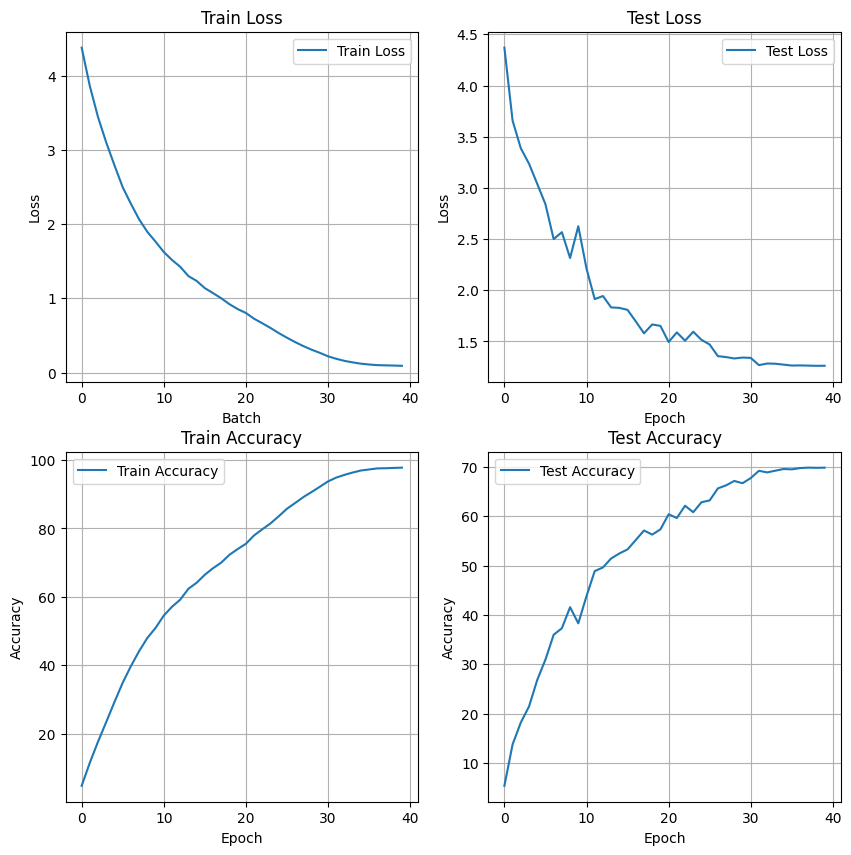
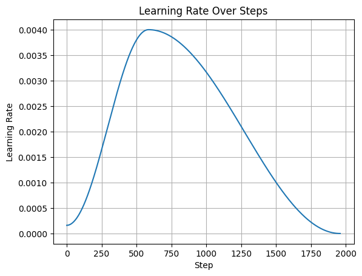

# CIFAR-100 Image Classification using ResNet

This repository contains the code for a ResNet-based image classifier trained on the CIFAR-100 dataset.

## Overview

This project implements a residual network (ResNet) architecture to classify images from the CIFAR-100 dataset. The model is built using PyTorch.

## Model Architecture

The model is a ResNet architecture with the flexibility to use either standard convolutional blocks or depthwise-separable convolutional blocks. This allows for experimenting with more efficient model variations. The specific configuration is defined in `model_v1.py`.

## Model Summary
```
Output shape: torch.Size([5, 100])
----------------------------------------------------------------
        Layer (type)               Output Shape         Param #
================================================================
            Conv2d-1           [-1, 64, 32, 32]           1,728
       BatchNorm2d-2           [-1, 64, 32, 32]             128
              ReLU-3           [-1, 64, 32, 32]               0
            Conv2d-4           [-1, 64, 32, 32]          36,864
       BatchNorm2d-5           [-1, 64, 32, 32]             128
              ReLU-6           [-1, 64, 32, 32]               0
            Conv2d-7           [-1, 64, 32, 32]          36,864
       BatchNorm2d-8           [-1, 64, 32, 32]             128
              ReLU-9           [-1, 64, 32, 32]               0
       BasicBlock-10           [-1, 64, 32, 32]               0
           Conv2d-11           [-1, 64, 32, 32]          36,864
      BatchNorm2d-12           [-1, 64, 32, 32]             128
             ReLU-13           [-1, 64, 32, 32]               0
           Conv2d-14           [-1, 64, 32, 32]          36,864
      BatchNorm2d-15           [-1, 64, 32, 32]             128
             ReLU-16           [-1, 64, 32, 32]               0
       BasicBlock-17           [-1, 64, 32, 32]               0
           Conv2d-18          [-1, 128, 16, 16]          73,728
      BatchNorm2d-19          [-1, 128, 16, 16]             256
             ReLU-20          [-1, 128, 16, 16]               0
           Conv2d-21          [-1, 128, 16, 16]         147,456
      BatchNorm2d-22          [-1, 128, 16, 16]             256
           Conv2d-23          [-1, 128, 16, 16]           8,192
      BatchNorm2d-24          [-1, 128, 16, 16]             256
             ReLU-25          [-1, 128, 16, 16]               0
       BasicBlock-26          [-1, 128, 16, 16]               0
           Conv2d-27          [-1, 128, 16, 16]         147,456
      BatchNorm2d-28          [-1, 128, 16, 16]             256
             ReLU-29          [-1, 128, 16, 16]               0
           Conv2d-30          [-1, 128, 16, 16]         147,456
      BatchNorm2d-31          [-1, 128, 16, 16]             256
             ReLU-32          [-1, 128, 16, 16]               0
       BasicBlock-33          [-1, 128, 16, 16]               0
           Conv2d-34            [-1, 128, 8, 8]           1,152
           Conv2d-35            [-1, 256, 8, 8]          32,768
DepthwiseSeparableConv2d-36            [-1, 256, 8, 8]               0
      BatchNorm2d-37            [-1, 256, 8, 8]             512
             ReLU-38            [-1, 256, 8, 8]               0
           Conv2d-39            [-1, 256, 8, 8]           2,304
           Conv2d-40            [-1, 256, 8, 8]          65,536
DepthwiseSeparableConv2d-41            [-1, 256, 8, 8]               0
      BatchNorm2d-42            [-1, 256, 8, 8]             512
           Conv2d-43            [-1, 256, 8, 8]          32,768
      BatchNorm2d-44            [-1, 256, 8, 8]             512
             ReLU-45            [-1, 256, 8, 8]               0
DepthwiseBasicBlock-46            [-1, 256, 8, 8]               0
           Conv2d-47            [-1, 256, 8, 8]           2,304
           Conv2d-48            [-1, 256, 8, 8]          65,536
DepthwiseSeparableConv2d-49            [-1, 256, 8, 8]               0
      BatchNorm2d-50            [-1, 256, 8, 8]             512
             ReLU-51            [-1, 256, 8, 8]               0
           Conv2d-52            [-1, 256, 8, 8]           2,304
           Conv2d-53            [-1, 256, 8, 8]          65,536
DepthwiseSeparableConv2d-54            [-1, 256, 8, 8]               0
      BatchNorm2d-55            [-1, 256, 8, 8]             512
             ReLU-56            [-1, 256, 8, 8]               0
DepthwiseBasicBlock-57            [-1, 256, 8, 8]               0
           Conv2d-58            [-1, 256, 8, 8]           2,304
           Conv2d-59            [-1, 256, 8, 8]          65,536
DepthwiseSeparableConv2d-60            [-1, 256, 8, 8]               0
      BatchNorm2d-61            [-1, 256, 8, 8]             512
             ReLU-62            [-1, 256, 8, 8]               0
           Conv2d-63            [-1, 256, 8, 8]           2,304
           Conv2d-64            [-1, 256, 8, 8]          65,536
DepthwiseSeparableConv2d-65            [-1, 256, 8, 8]               0
      BatchNorm2d-66            [-1, 256, 8, 8]             512
             ReLU-67            [-1, 256, 8, 8]               0
DepthwiseBasicBlock-68            [-1, 256, 8, 8]               0
           Conv2d-69            [-1, 256, 4, 4]           2,304
           Conv2d-70            [-1, 512, 4, 4]         131,072
DepthwiseSeparableConv2d-71            [-1, 512, 4, 4]               0
      BatchNorm2d-72            [-1, 512, 4, 4]           1,024
             ReLU-73            [-1, 512, 4, 4]               0
           Conv2d-74            [-1, 512, 4, 4]           4,608
           Conv2d-75            [-1, 512, 4, 4]         262,144
DepthwiseSeparableConv2d-76            [-1, 512, 4, 4]               0
      BatchNorm2d-77            [-1, 512, 4, 4]           1,024
           Conv2d-78            [-1, 512, 4, 4]         131,072
      BatchNorm2d-79            [-1, 512, 4, 4]           1,024
             ReLU-80            [-1, 512, 4, 4]               0
DepthwiseBasicBlock-81            [-1, 512, 4, 4]               0
           Conv2d-82            [-1, 512, 4, 4]           4,608
           Conv2d-83            [-1, 512, 4, 4]         262,144
DepthwiseSeparableConv2d-84            [-1, 512, 4, 4]               0
      BatchNorm2d-85            [-1, 512, 4, 4]           1,024
             ReLU-86            [-1, 512, 4, 4]               0
           Conv2d-87            [-1, 512, 4, 4]           4,608
           Conv2d-88            [-1, 512, 4, 4]         262,144
DepthwiseSeparableConv2d-89            [-1, 512, 4, 4]               0
      BatchNorm2d-90            [-1, 512, 4, 4]           1,024
             ReLU-91            [-1, 512, 4, 4]               0
DepthwiseBasicBlock-92            [-1, 512, 4, 4]               0
AdaptiveAvgPool2d-93            [-1, 512, 1, 1]               0
           Linear-94                  [-1, 100]          51,300
================================================================
Total params: 2,205,988
Trainable params: 2,205,988
Non-trainable params: 0
----------------------------------------------------------------
Input size (MB): 0.01
Forward/backward pass size (MB): 18.29
Params size (MB): 8.42
Estimated Total Size (MB): 26.71
----------------------------------------------------------------
```

## Results

The training and testing performance is summarized in the plots below, showing the loss and accuracy curves for both training and validation sets.

* Highest Accuracy achieved = 69.8%



## Learning Rate Schedule

The model was trained using a One Cycle Learning Rate policy. The learning rate schedule across the training epochs is shown below.



## Training Logs

```
loss=4.1090 batch_id=48: 100%|██████████| 49/49 [00:57<00:00,  1.17s/it]
Train set (epoch 0): Average loss: 4.3801, Accuracy: 2362/50000 (4.72%)

2025-10-08 12:31:11,455 - INFO - ✅ Checkpoint saved at epoch 1 to /content/drive/MyDrive/CIFAR100/checkpoint.pt
Test set (epoch 0): Average loss: 4.3700, Accuracy: 535/10000 (5.35%)

✅ Saved new best model at epoch 0 with loss 4.3700
loss=3.6239 batch_id=48: 100%|██████████| 49/49 [00:55<00:00,  1.13s/it]
Train set (epoch 1): Average loss: 3.8590, Accuracy: 5758/50000 (11.52%)

2025-10-08 12:32:10,553 - INFO - ✅ Checkpoint saved at epoch 2 to /content/drive/MyDrive/CIFAR100/checkpoint.pt
Test set (epoch 1): Average loss: 3.6562, Accuracy: 1376/10000 (13.76%)

✅ Saved new best model at epoch 1 with loss 3.6562
loss=3.2636 batch_id=48: 100%|██████████| 49/49 [00:55<00:00,  1.14s/it]
Train set (epoch 2): Average loss: 3.4401, Accuracy: 8843/50000 (17.69%)

2025-10-08 12:33:09,617 - INFO - ✅ Checkpoint saved at epoch 3 to /content/drive/MyDrive/CIFAR100/checkpoint.pt
Test set (epoch 2): Average loss: 3.3870, Accuracy: 1819/10000 (18.19%)

✅ Saved new best model at epoch 2 with loss 3.3870
loss=3.0501 batch_id=48: 100%|██████████| 49/49 [00:56<00:00,  1.16s/it]
Train set (epoch 3): Average loss: 3.0988, Accuracy: 11713/50000 (23.43%)

2025-10-08 12:34:09,942 - INFO - ✅ Checkpoint saved at epoch 4 to /content/drive/MyDrive/CIFAR100/checkpoint.pt
Test set (epoch 3): Average loss: 3.2361, Accuracy: 2144/10000 (21.44%)

✅ Saved new best model at epoch 3 with loss 3.2361
loss=2.6352 batch_id=48: 100%|██████████| 49/49 [00:57<00:00,  1.17s/it]
Train set (epoch 4): Average loss: 2.7922, Accuracy: 14633/50000 (29.27%)

2025-10-08 12:35:10,891 - INFO - ✅ Checkpoint saved at epoch 5 to /content/drive/MyDrive/CIFAR100/checkpoint.pt
Test set (epoch 4): Average loss: 3.0394, Accuracy: 2682/10000 (26.82%)

✅ Saved new best model at epoch 4 with loss 3.0394
loss=2.5564 batch_id=48: 100%|██████████| 49/49 [00:57<00:00,  1.18s/it]
Train set (epoch 5): Average loss: 2.4976, Accuracy: 17442/50000 (34.88%)

2025-10-08 12:36:12,389 - INFO - ✅ Checkpoint saved at epoch 6 to /content/drive/MyDrive/CIFAR100/checkpoint.pt
Test set (epoch 5): Average loss: 2.8406, Accuracy: 3095/10000 (30.95%)

✅ Saved new best model at epoch 5 with loss 2.8406
loss=2.1698 batch_id=48: 100%|██████████| 49/49 [00:57<00:00,  1.18s/it]
Train set (epoch 6): Average loss: 2.2740, Accuracy: 19865/50000 (39.73%)

2025-10-08 12:37:14,005 - INFO - ✅ Checkpoint saved at epoch 7 to /content/drive/MyDrive/CIFAR100/checkpoint.pt
Test set (epoch 6): Average loss: 2.5000, Accuracy: 3599/10000 (35.99%)

✅ Saved new best model at epoch 6 with loss 2.5000
loss=2.1183 batch_id=48: 100%|██████████| 49/49 [00:58<00:00,  1.20s/it]
Train set (epoch 7): Average loss: 2.0647, Accuracy: 22065/50000 (44.13%)

2025-10-08 12:38:16,709 - INFO - ✅ Checkpoint saved at epoch 8 to /content/drive/MyDrive/CIFAR100/checkpoint.pt
Test set (epoch 7): Average loss: 2.5676, Accuracy: 3731/10000 (37.31%)

loss=1.8726 batch_id=48: 100%|██████████| 49/49 [00:57<00:00,  1.17s/it]
Train set (epoch 8): Average loss: 1.8962, Accuracy: 23987/50000 (47.97%)

2025-10-08 12:39:17,544 - INFO - ✅ Checkpoint saved at epoch 9 to /content/drive/MyDrive/CIFAR100/checkpoint.pt
Test set (epoch 8): Average loss: 2.3153, Accuracy: 4158/10000 (41.58%)

✅ Saved new best model at epoch 8 with loss 2.3153
loss=1.7129 batch_id=48: 100%|██████████| 49/49 [01:00<00:00,  1.24s/it]
Train set (epoch 9): Average loss: 1.7644, Accuracy: 25453/50000 (50.91%)

2025-10-08 12:40:22,197 - INFO - ✅ Checkpoint saved at epoch 10 to /content/drive/MyDrive/CIFAR100/checkpoint.pt
Test set (epoch 9): Average loss: 2.6260, Accuracy: 3830/10000 (38.30%)

loss=1.6954 batch_id=48: 100%|██████████| 49/49 [00:57<00:00,  1.16s/it]
Train set (epoch 10): Average loss: 1.6254, Accuracy: 27255/50000 (54.51%)

2025-10-08 12:41:22,716 - INFO - ✅ Checkpoint saved at epoch 11 to /content/drive/MyDrive/CIFAR100/checkpoint.pt
Test set (epoch 10): Average loss: 2.2115, Accuracy: 4382/10000 (43.82%)

✅ Saved new best model at epoch 10 with loss 2.2115
loss=1.6029 batch_id=48: 100%|██████████| 49/49 [00:57<00:00,  1.18s/it]
Train set (epoch 11): Average loss: 1.5177, Accuracy: 28540/50000 (57.08%)

2025-10-08 12:42:24,058 - INFO - ✅ Checkpoint saved at epoch 12 to /content/drive/MyDrive/CIFAR100/checkpoint.pt
Test set (epoch 11): Average loss: 1.9137, Accuracy: 4890/10000 (48.90%)

✅ Saved new best model at epoch 11 with loss 1.9137
loss=1.4998 batch_id=48: 100%|██████████| 49/49 [00:59<00:00,  1.21s/it]
Train set (epoch 12): Average loss: 1.4262, Accuracy: 29583/50000 (59.17%)

2025-10-08 12:43:27,129 - INFO - ✅ Checkpoint saved at epoch 13 to /content/drive/MyDrive/CIFAR100/checkpoint.pt
Test set (epoch 12): Average loss: 1.9439, Accuracy: 4963/10000 (49.63%)

loss=1.3365 batch_id=48: 100%|██████████| 49/49 [00:59<00:00,  1.21s/it]
Train set (epoch 13): Average loss: 1.3002, Accuracy: 31172/50000 (62.34%)

2025-10-08 12:44:30,442 - INFO - ✅ Checkpoint saved at epoch 14 to /content/drive/MyDrive/CIFAR100/checkpoint.pt
Test set (epoch 13): Average loss: 1.8327, Accuracy: 5146/10000 (51.46%)

✅ Saved new best model at epoch 13 with loss 1.8327
loss=1.2593 batch_id=48: 100%|██████████| 49/49 [00:58<00:00,  1.19s/it]
Train set (epoch 14): Average loss: 1.2353, Accuracy: 32054/50000 (64.11%)

2025-10-08 12:45:32,795 - INFO - ✅ Checkpoint saved at epoch 15 to /content/drive/MyDrive/CIFAR100/checkpoint.pt
Test set (epoch 14): Average loss: 1.8284, Accuracy: 5247/10000 (52.47%)

✅ Saved new best model at epoch 14 with loss 1.8284
loss=1.2087 batch_id=48: 100%|██████████| 49/49 [00:57<00:00,  1.18s/it]
Train set (epoch 15): Average loss: 1.1378, Accuracy: 33227/50000 (66.45%)

2025-10-08 12:46:34,252 - INFO - ✅ Checkpoint saved at epoch 16 to /content/drive/MyDrive/CIFAR100/checkpoint.pt
Test set (epoch 15): Average loss: 1.8087, Accuracy: 5330/10000 (53.30%)

✅ Saved new best model at epoch 15 with loss 1.8087
loss=1.1715 batch_id=48: 100%|██████████| 49/49 [00:57<00:00,  1.18s/it]
Train set (epoch 16): Average loss: 1.0705, Accuracy: 34184/50000 (68.37%)

2025-10-08 12:47:35,439 - INFO - ✅ Checkpoint saved at epoch 17 to /content/drive/MyDrive/CIFAR100/checkpoint.pt
Test set (epoch 16): Average loss: 1.6962, Accuracy: 5520/10000 (55.20%)

✅ Saved new best model at epoch 16 with loss 1.6962
loss=1.0095 batch_id=48: 100%|██████████| 49/49 [00:56<00:00,  1.16s/it]
Train set (epoch 17): Average loss: 1.0012, Accuracy: 35000/50000 (70.00%)

Test set (epoch 17): Average loss: 1.5799, Accuracy: 5713/10000 (57.13%)

✅ Saved new best model at epoch 17 with loss 1.5799
2025-10-08 12:48:36,449 - INFO - ✅ Checkpoint saved at epoch 18 to /content/drive/MyDrive/CIFAR100/checkpoint.pt
loss=1.0261 batch_id=48: 100%|██████████| 49/49 [00:58<00:00,  1.19s/it]
Train set (epoch 18): Average loss: 0.9214, Accuracy: 36146/50000 (72.29%)

2025-10-08 12:49:38,165 - INFO - ✅ Checkpoint saved at epoch 19 to /content/drive/MyDrive/CIFAR100/checkpoint.pt
Test set (epoch 18): Average loss: 1.6661, Accuracy: 5630/10000 (56.30%)

loss=0.9543 batch_id=48: 100%|██████████| 49/49 [00:56<00:00,  1.15s/it]
Train set (epoch 19): Average loss: 0.8553, Accuracy: 36980/50000 (73.96%)

2025-10-08 12:50:38,647 - INFO - ✅ Checkpoint saved at epoch 20 to /content/drive/MyDrive/CIFAR100/checkpoint.pt
Test set (epoch 19): Average loss: 1.6521, Accuracy: 5735/10000 (57.35%)

loss=0.8251 batch_id=48: 100%|██████████| 49/49 [00:56<00:00,  1.16s/it]
Train set (epoch 20): Average loss: 0.8033, Accuracy: 37754/50000 (75.51%)

2025-10-08 12:51:39,049 - INFO - ✅ Checkpoint saved at epoch 21 to /content/drive/MyDrive/CIFAR100/checkpoint.pt
Test set (epoch 20): Average loss: 1.4952, Accuracy: 6042/10000 (60.42%)

✅ Saved new best model at epoch 20 with loss 1.4952
loss=0.7549 batch_id=48: 100%|██████████| 49/49 [00:57<00:00,  1.16s/it]
Train set (epoch 21): Average loss: 0.7251, Accuracy: 38980/50000 (77.96%)

2025-10-08 12:52:39,994 - INFO - ✅ Checkpoint saved at epoch 22 to /content/drive/MyDrive/CIFAR100/checkpoint.pt
Test set (epoch 21): Average loss: 1.5885, Accuracy: 5966/10000 (59.66%)

loss=0.6975 batch_id=48: 100%|██████████| 49/49 [00:56<00:00,  1.16s/it]
Train set (epoch 22): Average loss: 0.6642, Accuracy: 39873/50000 (79.75%)

2025-10-08 12:53:40,018 - INFO - ✅ Checkpoint saved at epoch 23 to /content/drive/MyDrive/CIFAR100/checkpoint.pt
Test set (epoch 22): Average loss: 1.5080, Accuracy: 6215/10000 (62.15%)

loss=0.6646 batch_id=48: 100%|██████████| 49/49 [00:57<00:00,  1.18s/it]
Train set (epoch 23): Average loss: 0.6007, Accuracy: 40736/50000 (81.47%)

2025-10-08 12:54:41,323 - INFO - ✅ Checkpoint saved at epoch 24 to /content/drive/MyDrive/CIFAR100/checkpoint.pt
Test set (epoch 23): Average loss: 1.5952, Accuracy: 6084/10000 (60.84%)

loss=0.5466 batch_id=48: 100%|██████████| 49/49 [00:56<00:00,  1.15s/it]
Train set (epoch 24): Average loss: 0.5322, Accuracy: 41776/50000 (83.55%)

2025-10-08 12:55:40,965 - INFO - ✅ Checkpoint saved at epoch 25 to /content/drive/MyDrive/CIFAR100/checkpoint.pt
Test set (epoch 24): Average loss: 1.5160, Accuracy: 6286/10000 (62.86%)

loss=0.5098 batch_id=48: 100%|██████████| 49/49 [00:56<00:00,  1.16s/it]
Train set (epoch 25): Average loss: 0.4696, Accuracy: 42876/50000 (85.75%)

2025-10-08 12:56:41,428 - INFO - ✅ Checkpoint saved at epoch 26 to /content/drive/MyDrive/CIFAR100/checkpoint.pt
Test set (epoch 25): Average loss: 1.4702, Accuracy: 6323/10000 (63.23%)

✅ Saved new best model at epoch 25 with loss 1.4702
loss=0.4383 batch_id=48: 100%|██████████| 49/49 [00:56<00:00,  1.16s/it]
Train set (epoch 26): Average loss: 0.4105, Accuracy: 43715/50000 (87.43%)

2025-10-08 12:57:42,040 - INFO - ✅ Checkpoint saved at epoch 27 to /content/drive/MyDrive/CIFAR100/checkpoint.pt
Test set (epoch 26): Average loss: 1.3567, Accuracy: 6567/10000 (65.67%)

✅ Saved new best model at epoch 26 with loss 1.3567
loss=0.3400 batch_id=48: 100%|██████████| 49/49 [00:56<00:00,  1.16s/it]
Train set (epoch 27): Average loss: 0.3562, Accuracy: 44580/50000 (89.16%)

2025-10-08 12:58:42,305 - INFO - ✅ Checkpoint saved at epoch 28 to /content/drive/MyDrive/CIFAR100/checkpoint.pt
Test set (epoch 27): Average loss: 1.3478, Accuracy: 6629/10000 (66.29%)

✅ Saved new best model at epoch 27 with loss 1.3478
loss=0.3175 batch_id=48: 100%|██████████| 49/49 [00:57<00:00,  1.17s/it]
Train set (epoch 28): Average loss: 0.3080, Accuracy: 45323/50000 (90.65%)

2025-10-08 12:59:43,668 - INFO - ✅ Checkpoint saved at epoch 29 to /content/drive/MyDrive/CIFAR100/checkpoint.pt
Test set (epoch 28): Average loss: 1.3342, Accuracy: 6718/10000 (67.18%)

✅ Saved new best model at epoch 28 with loss 1.3342
loss=0.2648 batch_id=48: 100%|██████████| 49/49 [00:56<00:00,  1.15s/it]
Train set (epoch 29): Average loss: 0.2657, Accuracy: 46085/50000 (92.17%)

2025-10-08 13:00:43,565 - INFO - ✅ Checkpoint saved at epoch 30 to /content/drive/MyDrive/CIFAR100/checkpoint.pt
Test set (epoch 29): Average loss: 1.3431, Accuracy: 6672/10000 (66.72%)

loss=0.2367 batch_id=48: 100%|██████████| 49/49 [01:01<00:00,  1.25s/it]
Train set (epoch 30): Average loss: 0.2191, Accuracy: 46872/50000 (93.74%)

2025-10-08 13:01:48,005 - INFO - ✅ Checkpoint saved at epoch 31 to /content/drive/MyDrive/CIFAR100/checkpoint.pt
Test set (epoch 30): Average loss: 1.3397, Accuracy: 6776/10000 (67.76%)

loss=0.1799 batch_id=48: 100%|██████████| 49/49 [00:56<00:00,  1.15s/it]
Train set (epoch 31): Average loss: 0.1854, Accuracy: 47431/50000 (94.86%)

2025-10-08 13:02:48,643 - INFO - ✅ Checkpoint saved at epoch 32 to /content/drive/MyDrive/CIFAR100/checkpoint.pt
Test set (epoch 31): Average loss: 1.2689, Accuracy: 6924/10000 (69.24%)

✅ Saved new best model at epoch 31 with loss 1.2689
loss=0.1661 batch_id=48: 100%|██████████| 49/49 [00:58<00:00,  1.19s/it]
Train set (epoch 32): Average loss: 0.1574, Accuracy: 47830/50000 (95.66%)

2025-10-08 13:03:50,175 - INFO - ✅ Checkpoint saved at epoch 33 to /content/drive/MyDrive/CIFAR100/checkpoint.pt
Test set (epoch 32): Average loss: 1.2847, Accuracy: 6891/10000 (68.91%)

loss=0.1848 batch_id=48: 100%|██████████| 49/49 [00:57<00:00,  1.17s/it]
Train set (epoch 33): Average loss: 0.1370, Accuracy: 48170/50000 (96.34%)

2025-10-08 13:04:50,733 - INFO - ✅ Checkpoint saved at epoch 34 to /content/drive/MyDrive/CIFAR100/checkpoint.pt
Test set (epoch 33): Average loss: 1.2829, Accuracy: 6926/10000 (69.26%)

loss=0.1090 batch_id=48: 100%|██████████| 49/49 [00:56<00:00,  1.16s/it]
Train set (epoch 34): Average loss: 0.1197, Accuracy: 48465/50000 (96.93%)

2025-10-08 13:05:51,502 - INFO - ✅ Checkpoint saved at epoch 35 to /content/drive/MyDrive/CIFAR100/checkpoint.pt
Test set (epoch 34): Average loss: 1.2738, Accuracy: 6960/10000 (69.60%)

loss=0.1182 batch_id=48: 100%|██████████| 49/49 [00:56<00:00,  1.16s/it]
Train set (epoch 35): Average loss: 0.1084, Accuracy: 48618/50000 (97.24%)

2025-10-08 13:06:51,623 - INFO - ✅ Checkpoint saved at epoch 36 to /content/drive/MyDrive/CIFAR100/checkpoint.pt
Test set (epoch 35): Average loss: 1.2649, Accuracy: 6953/10000 (69.53%)

✅ Saved new best model at epoch 35 with loss 1.2649
loss=0.1007 batch_id=48: 100%|██████████| 49/49 [00:56<00:00,  1.16s/it]
Train set (epoch 36): Average loss: 0.0999, Accuracy: 48777/50000 (97.55%)

2025-10-08 13:07:52,311 - INFO - ✅ Checkpoint saved at epoch 37 to /content/drive/MyDrive/CIFAR100/checkpoint.pt
Test set (epoch 36): Average loss: 1.2662, Accuracy: 6979/10000 (69.79%)

loss=0.0826 batch_id=48: 100%|██████████| 49/49 [00:56<00:00,  1.16s/it]
Train set (epoch 37): Average loss: 0.0968, Accuracy: 48797/50000 (97.59%)

2025-10-08 13:08:52,771 - INFO - ✅ Checkpoint saved at epoch 38 to /content/drive/MyDrive/CIFAR100/checkpoint.pt
Test set (epoch 37): Average loss: 1.2644, Accuracy: 6988/10000 (69.88%)

✅ Saved new best model at epoch 37 with loss 1.2644
loss=0.0986 batch_id=48: 100%|██████████| 49/49 [00:57<00:00,  1.17s/it]
Train set (epoch 38): Average loss: 0.0941, Accuracy: 48844/50000 (97.69%)

2025-10-08 13:09:53,530 - INFO - ✅ Checkpoint saved at epoch 39 to /content/drive/MyDrive/CIFAR100/checkpoint.pt
Test set (epoch 38): Average loss: 1.2623, Accuracy: 6984/10000 (69.84%)

✅ Saved new best model at epoch 38 with loss 1.2623
loss=0.0970 batch_id=48: 100%|██████████| 49/49 [00:57<00:00,  1.17s/it]
Train set (epoch 39): Average loss: 0.0907, Accuracy: 48887/50000 (97.77%)

2025-10-08 13:10:54,488 - INFO - ✅ Checkpoint saved at epoch 40 to /content/drive/MyDrive/CIFAR100/checkpoint.pt
Test set (epoch 39): Average loss: 1.2629, Accuracy: 6987/10000 (69.87%)
```

